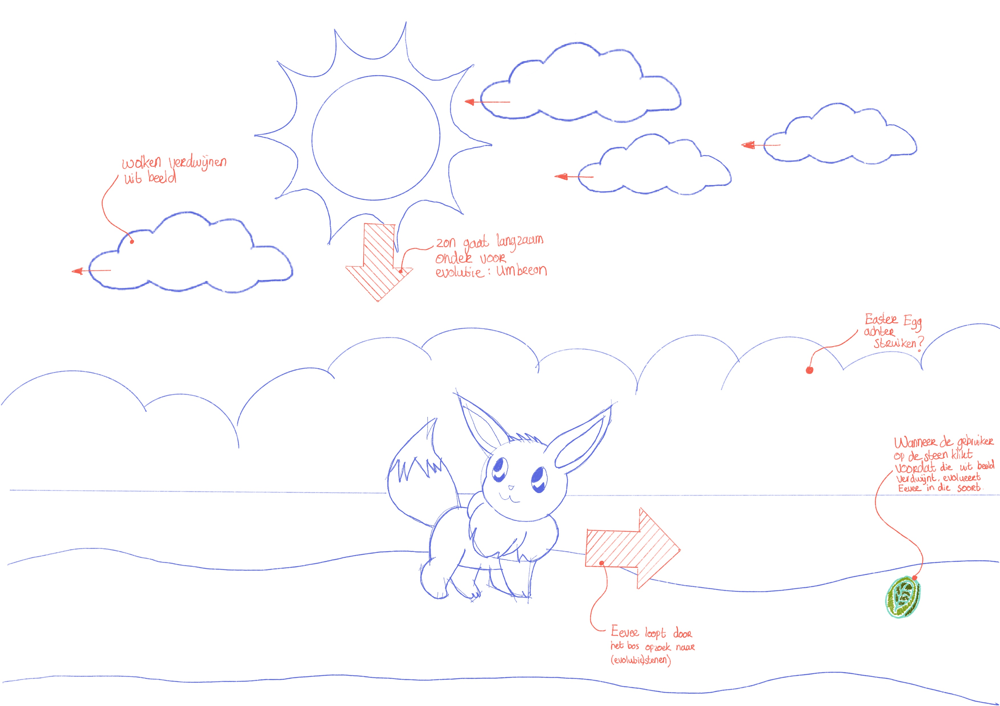

# Procesverslag
Markdown is een simpele manier om HTML te schrijven.  
Markdown cheat cheet: [Hulp bij het schrijven van Markdown](https://github.com/adam-p/markdown-here/wiki/Markdown-Cheatsheet).

Nb. De standaardstructuur en de spartaanse opmaak van de README.md zijn helemaal prima. Het gaat om de inhoud van je procesverslag. Besteedt de tijd voor pracht en praal aan je website.

Nb. Door *open* toe te voegen aan een *details* element kun je deze standaard open zetten. Fijn om dat steeds voor de relevante stuk(ken) te doen.

## Jij

### Ontwerper:
Olivier Leufkens

#### Je startniveau:
Blauw

# Je plan

  
Tijdens de eerste les van het vak 'Interface en Interactie' kon er een keuze gemaakt worden tussen twee opdrachten. Hierbij is de keuze gemaakt om de Eeveelution ui te werken. Er werd bij verteld dat het een iets lastigere opdracht was dan de tijdlijn, maar een uitdaging zag ik wel zitten. Daarnaast heb ik vroeger veel Pokémon gespeeld als game en vond ik het interessant om daar mijn eigen interface bij te bedenken. Hierbij is er een schets gemaakt voor een eerste ontwerp.
  

  ### De eerste versie/schets:
  

  ### Je ambitie: 
  Kwaliteiten die ik wil verbeteren als ontwerper:
  - De basiskennis verbreeden als het gaat om coderen.
  - Uitdagingen aangaan om nieuwe functies onderd knie te krijgen.
  - Ingewikkelde vormen volledig creëren in CSS.
 

## Voortgang/Feedback 1

  
De start van de opdracht was lastig, omdat er vanuit een lege HTML/CSS een basis code geschreven moest worden. De eerste twee introductielessen hadden geholpen bij het vergaren van kennis over HTML en CSS, maar met een georderde structuur beginnen was lastig. Daarom is er aan het begin een (korte) plan van aanpak gemaakt om te kijken met welke elementen het handig is om mee te beginnen

  ### Bevinding & oplossing 1:
  Vanuit de schets is er een zijn er basiselementen geprobeerd te maken, zoals de achtergrond met wolken. Hierbij stuitte ik al snel op een knelpunt; de wolken zijn geen makkelijke vormen om te maken in CSS. Hierdoor is er gekeken naar de vorm van de wolk en hoe die het beste gemaakt kan worden in CSS. Hierbij is er een :before en :after gemaakt door middel van een tutorial, waarbij er gebruik is gemaakt van geometrische vormen. In de schets hieronder is te zien uit welke vormen de wolk tot stand is gekomen.

  

  ### Bevinding & oplossing 2:
  Bij de eerste feedback kwamen er een aantal leuke ideeen naar boven die ik mogelijk kon toepassen in mijn ontwerp. Echter bleek al snel dat mijn idee te ingewikkeld was om om in 1,5 week uit te werken. Het idee was om meerdere paden te maken zodat de gebruiker kon kiezen welke kant hij op kon. Waarbij het seizoen ook steeds meeveranderd om alle evoluties mogelijk te maken. Uit de feedback en mijn niveau is er gekozen om een 1 pagina-scherm te ontwikkelen, waarbij de stenen letterlijk als eastereggs verstopt worden. Het is nog wel de bedoeling om een dag/nacht functie te creëren.

## Voortgang/Feedback 2

  
Eenmaal de basis van de pagina te hebben ontwikkeld, was het de bedoeling om de eerste buttons toe te voegen aan de website. Hierbij was het idee om afbeeldingen van de evolueerstenen te koppelen aan de buttons.

  
  ### Bevinding & oplossing 1:
  Het aanmmaken van een button verliep boven verwachting goed. Door het voorbeeld te volgen lukte het snel om een transitie tussen twee afbeeldingen te maken met behulp van Javascript. Echter kreeg ik als feedback dat de buttons zich nog niet representeerde als een button doordat er geen feedback naar de gebruiker was dat je er mogelijk op kon klikken. Daarom is er een hoverstate toegevoegd met een kleine transitie, waarbij een een tooltip tevoorschijn komt. Zo krijgt de gebruiker meer interactie met het scherm en begrijpt die ook eerder wat die aan het doen is.

  ### Bevinding & oplossing 2:
  In het concept was het het idee om de zon als een 'verstopte' button te ontwikkelen, zodat er een transitie gemaakt kon worden naar dag en nacht. Al snel bleek door tijddruk dat het niet meer haalbaar was met mijn eigen kennis. Daarom is er voor gekozen om twee buttons toe te voegen, omdat het voor bij wel duidelijk was hoe ik dat kon realiseren in Javascript.

## Voortgang/Feedback 3

  
Bij de laatste feedbacksessie is er nog gekeken naar detail in de code en de vormgeving van de interface om zo een een optimaal design neer te zetten. Hierbij is er gekeken wat er haalbaar is in de tijd.

  
  ### Bevinding & oplossing 1:
  Allereerst is er gekeken of de code geoptimaliseerd kon worden. Uit de feedback bleek dat het overzicht inde code een beetje verdwenen was, waardoor bepaalde elementen moeilijk terug te vinden waren. Daarom is er aantekenigen en witregels tussen de codes gezet, om zo het overzicht terug te krijgen in de code. 

  ### Bevinding & oplossing 2:
 Daarnaast werd bij de feeback verteld dat het aanmaken van een 'nth-of-type' bij de buttons gemakkelijk is dan steeds het aanmaken van een 'class'. Daarom is er voor gekozen om de code aan te passen. Uiteindelijk vond ik ook dat dit een stuk gemakkelijker werkte dan wat ik voorheen deed.

  ### Bevinding & oplossing 3:
  In de feedback werd verteld dat het overzicht nog lastig te zien was in de HTML. Er wordt nog veel gebruik gemaakt van 'div' en niet van 'ol' en daarbinnen 'li'.
  In de code is er gekeken wat er nog aangepast kon worden, maar ik hierbij werd er snel opgemerkt dat mijn code niet meer naar behoren werkte zoals ik het wilde. Daarom is de 'div' behouden.

## Reflectie

  
Mijn eindresultaat & persoonlijke ontwikkeling

  ### Je uitkomst - karakteristiek screenshot(s):
  

  ### Dit ging goed/Heb ik geleerd: 
  Op sommige momenten overtrof ik mijn verwachten, omdat ik er vanuit ging dat die code niet zou werken. Zoals het aanmaken van animaties en het toepassen van Javascript. Als iets lukt dan is coderen ook echt leuk.

  In de afgelopen twee weken heb ik geleerd hoe ik een code kan opzetten en hoe ik die gestructureerd kan ontwikkelen. Ook hoe ik ingewikkelde vormen kan ontwikkelen.

  Ik ben benieuwd naar het het vak Webtypografie waarbij we verder gaan op code. Hierbij hoop ik mijn vaardigheden als ontwerper verder te verdiepen

  ### Dit was lastig/Is niet gelukt:
  De afgelopen twee weken waren best hectisch, omdat code voor mij eerst nog Chinees was, zit het nu op een Frans/Spaans niveau. Hiermee bedoel ik dat ik code nu wel kan lezen, maar dat ik het nog lastig vind om de code zelf te schrijven. CMD is dan ook niet mijn afkomst, maar ik vind het wel zeer interessant om er meer kennis te vergaren in code. 

  Het is dan ook helaas niet gelukt om de transitie naar dag en nacht werkelijk te maken. Bij een vervolg project zou ik mij dus meer willen verdiepen in grotere transities met meerdere elementen. Bij dit ontwerp is het nog bescheiden gehouden met enkele transities.

  Daarnaast is het maken van meerdere schermen ook niet gelukt, zoals dat wel eerst in mijn concept was opschreven

  Als laatste aanbeveling voor mijzelf is het handig om in het begin je HTML/CSS code op een gestuctureerde manier te beginnen. Minder gebruik van 'div' en meer 'ol' en daarbinnen 'li'.

  Tijdsdruk was bij dit vak wel een vuilkuil, waardoor sommigen elementen niet volledig zijn ontwikkeld zoals ik gewild had. Zo is de evolutie van espeon niet ontwikkeld. Bij het vervolg van projecten is het daarom van belang om een goede planning te maken, voordat ik begin aan mijn ontwerp.

  Ik sluit af dat ik wel trots ben wat ik geleverd heb. Ik had nooit gedacht dat ik dit mij zou lukken met code.

  

## Bronnenlijst

Bronnelijst/literatuur

EEVEELUTIONS:
1. https://bulbapedia.bulbagarden.net/wiki/Umbreon_(Pok%C3%A9mon)
2. https://bulbapedia.bulbagarden.net/wiki/Leafeon_(Pok%C3%A9mon)
3. https://www.pngitem.com/middle/Txoxibw_pokemon-sylveon-png-png-download-transparent-png/
4. https://nl.pinterest.com/pin/589549407452555973/
5. https://www.pngegg.com/en/search?q=jolteon
6. https://bulbapedia.bulbagarden.net/wiki/Eevee_(Pok%C3%A9mon)
7. https://bulbapedia.bulbagarden.net/wiki/Glaceon_(Pok%C3%A9mon)

STONES:
8. https://www.nicepng.com/ourpic/u2w7w7o0q8u2y3r5_pokemon-water-stone-water-stone-pokemon-png/
9. https://www.ign.com/wikis/pokemon-black-and-white/Fire_Stone
10. https://www.seekpng.com/ipng/u2q8e6t4a9w7i1i1_leaf-stone-pokemon-leaf-stone/
11. https://www.ign.com/wikis/pokemon-black-and-white/Thunder_Stone

